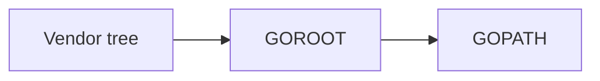

# 2020年10月

## Go

### 概要

Go自体を学習したいわけではないが、やりたい事の実現度が高い。

ただ、Goを今から覚えるにあたり色々とサイトを閲覧しているが、どうやら1.11以前と以降で考え方が変わっている。

その為、まずは今までに何があり、現状のベストプラクティス(現行バージョン推奨)を探る必要がある。

### 環境

- Windows 10

- Go 1.15

### Goパッケージ

#### GOPATH

標準パッケージとgithub等に公開されているソース等を自分のプロジェクトに取り込む事ができる。

ただ、以前のバージョンではGoソースは特定ディレクトリ($GOPATH/src)に配置する必要があった。

当然、このパッケージも($$GOPATH/src)配下に配置される事になる。その為、プロジェクトに応じて$GOPATHを設定し直す等の方法が必要だった。(Windowsの場合は、環境変数)

#### Vendoring

go1.5でVendoringが導入され、プロジェクト直下のvendorディレクトリにパッケージを配置する事が出来るようになった。

パッケージの検索ルートは

依存管理ツールとしてglida,depといったものがあるが、現状ではmodulesを用いるのがベストである。

depで管理されているプロジェクトについては「Gopkg.toml」ファイルがあればgo modにて簡単に移行できる(go run main.goのようにビルド&実行時に自動でmodules形式のファイルを作成してくれる)

なのでgithubで見つけてきた古いサンプルでもdepを覚える必要はない。

#### modules