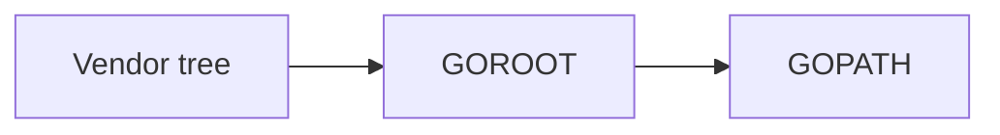

# 2020年10月

## Go

### 概要

Go自体を学習したいわけではないが、やりたい事の実現度が高い。

ただ、Goを今から覚えるにあたり色々とサイトを閲覧しているが、どうやら1.11以前と以降で考え方が変わっている。

その為、まずは今までに何があり、現状のベストプラクティス(現行バージョン推奨)を探る必要がある。

### 環境

- Windows 10

- Go 1.15

### Goパッケージ

#### GOPATH

標準パッケージとgithub等に公開されているソース等を自分のプロジェクトに取り込む事ができる。

ただ、以前のバージョンではGoソースは特定ディレクトリ($GOPATH/src)に配置する必要があった。

当然、このパッケージも($$GOPATH/src)配下に配置される事になる。その為、プロジェクトに応じて$GOPATHを設定し直す等の方法が必要だった。(Windowsの場合は、環境変数)

#### Vendoring

go1.5でVendoringが導入され、プロジェクト直下のvendorディレクトリにパッケージを配置する事が出来るようになった。

パッケージの検索ルートは




依存管理ツールとしてglida,depといったものがあるが、現状ではmodulesを用いるのがベストである。

depで管理されているプロジェクトについては「Gopkg.toml」ファイルがあればgo modにて簡単に移行できる(go run main.goのようにビルド&実行時に自動でmodules形式のファイルを作成してくれる)

なのでgithubで見つけてきた古いサンプルでもdepを覚える必要はない。

#### modules

Go1.11以降、GOPATH配下へのプロジェクトの配置が不要になった。

使用しているライブラリ等は$GOPATH/pkg/mod以下に配置される。バージョン管理も行われるのでプロジェクト毎に調整を行う必要がなくなった。

#### go.modとgo.sum

node.jsで言うところのpackage.jsonとpackage.json.lockにあたるもの？というイメージ。

go.modは下記のコマンドで作成する

```
go mod init パッケージ名
```

#### 参考

- [【Go言語】modulesについて理解するために過去から調べてみた](https://qiita.com/yoshinori_hisakawa/items/268ba201611401ca7935)

- [他言語から来た人がGoを使い始めてすぐハマったこととその答え](https://qiita.com/mumoshu/items/0d2f2a13c6e9fc8da2a4)

### その他

#### goenv

node.jsで言うところのnvmやnodistにあたるGo自体のバージョン管理を行う。

ただ、大体ヒットするサイトはMacが多く、Windowsは皆無なので諦めるしかないかも。

どうしてもバージョン管理を行いたいのであればWSL2+VSCode Remoteで環境を作成する方法も考えられる。

#### GopherJS

GoをJavaScriptに変換を行ってくれる。概ねの標準ライブラリがサポートされている。

ただ、自分で書いたコード+ランタイムが含まれる為、一般的なWeb系で使うにはあまりにも大きすぎる(Hello Worldを返すHTTPサーバーで6MB)

このソフトウェアはやりたい事の実現方法として考えられたが、NETパッケージ(ネットワーク関連)だけはほぼサポートされておらず残念ながら違うアプローチが必要になった。

ちなみに2020/10/08時点では、Go1.12でないと動作しない。

#### 参考

- [Supported Packages](https://github.com/gopherjs/gopherjs/blob/master/doc/packages.md)