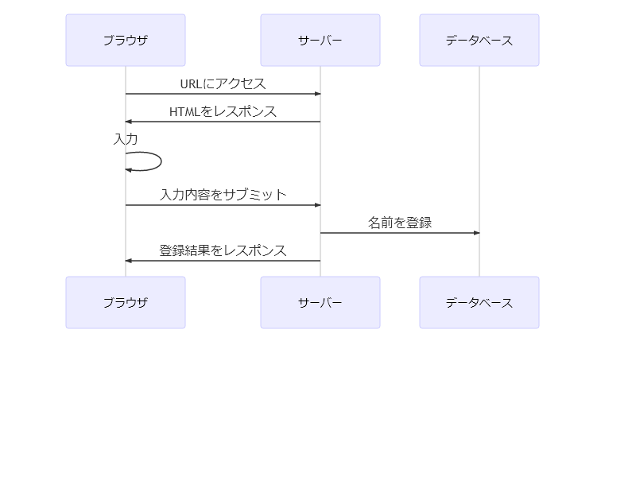

# 2020年11月

## Identity Aware Proxy

Identity Aware Proxy(以降、IAP)を使用するとユーザーを簡単に制御する事が可能となる

例えば、GAEにてアプリをデプロイすると基本的に誰でもアクセス可能な状態となる

アプリ内でユーザー制限を行っていたとしても少なくともログイン画面は表示できる状態である

インターネットとアプリの境界間にIAPの承認レイヤを入れる事で許可されたユーザー以外はアクセスを不可とする事ができるようになる

### 設定方法

GCPコンソールより「IAMと管理」-「Identity-Aware Proxy」より設定を行う

### メンバー追加可能なアカウント

|アカウント種類|
|:-|
|Google アカウント|
|Google グループ|
|サービスアカウント|
|G Suiteのドメイン|

### 確認が必要な事

chromeにログインしていれば毎回ログインを行う必要がないはず

### デメリット

ユーザを手動で追加する必要があり、管理が煩雑である(普通のシステムでもユーザーメンテは必要なので同じ？)

外部IDを使用するとGoogleアカウント以外(メール/パスワード、Facebook、Twitter等)で承認させる事が可能となる。(ただし、Firebaseによる実装が必要となる)

##### 参考

[Identity-Aware Proxy の概要](https://cloud.google.com/iap/docs/concepts-overview?hl=ja)

[外部 ID の有効化](https://cloud.google.com/iap/docs/enable-external-identities?hl=ja)

[面倒なアプリのログイン機能を超簡単に実装する on GCP](https://medium.com/google-cloud-jp/%E9%9D%A2%E5%80%92%E3%81%AA%E3%82%A2%E3%83%97%E3%83%AA%E3%81%AE%E3%83%AD%E3%82%B0%E3%82%A4%E3%83%B3%E6%A9%9F%E8%83%BD%E3%82%92%E8%B6%85%E7%B0%A1%E5%8D%98%E3%81%AB%E5%AE%9F%E8%A3%85%E3%81%99%E3%82%8B-on-gcp-13db17d6dd2b)

[【GCP】BeyondCorpについて調べてみた](https://qiita.com/Mune_robo/items/5ac7ca29469b6fc454e2)

## Cloud Storage

### オブジェクトのライフサイクル管理

オブジェクトに対して有効期間(TTL)を設定する事が可能

例えば、作成されてから1年が経過した場合に削除する事を設定できる

Webサービスにおいて自前で削除バッチを用意する必要がない

## React

### 概要

Webアプリケーションにおいて基本的にUIはHTMLベースである(Flashのような例外は除く)

例えば名前を登録するプログラムを考えた場合、次のようなフローとなる



JavaやPHPといった所謂サーバーサイドだけで完結させる事は可能である

昨今のWebアプリケーション開発においてわざわざクライアントサイドとサーバーサイドに分離し、異なるアーキテクチャを使用して苦労してまで実装する必要があるのかという疑問が湧かないのだろうか？

インタラクティブなインターフェースを提供する場合、どうしてもDOMを操作する必要がある

ユーザー操作時にサーバーへ毎回リクエストし、必要なDOMを生成して差分描画を行う方法もあるが、応答性としてはクライアントサイドで処理を行った方が有利である

フレームワークを使用しないでもvanila JS(同名のフレームワークがあるがここでは素のJavaScriptの意)でも同様の物のは作成できるが、とても生産性、品質という点でフレームワークを超える事は難しいだろう

### Reactとは

Facebookによって開発されているSPA用フロントエンド向けのJSフレームワーク

Vue.jsと比較して手軽ではなく、学習コストは高めである

パフォーマンスや堅牢さでは優っている(Vue.jsが次期バージョンでtypescriptに完全対応すると変わる可能性もある)

[完全に独断と偏見だけどReact vs Vue してみた](https://qiita.com/102Design/items/ae018dc80a4d879d92a8)

### next.js

Vue.jsのSSR(サーバーサイドレンダリング)のnuxt.jsと名前が似ているがこちらはReactのSSR

開発はvercel

[NEXT.js](https://nextjs-docs-ja.netlify.app/docs)

### React　プロジェクト作成

下記のコマンドによりプロジェクトが作成される。(3～4分ぐらい掛かる)

公式のテンプレートであるが、実際には不要なものが含まれている可能性がある

```
npx create-react-app [プロジェクト名]
```

create-react-appスクリプトに頼らない場合は下記のとおり。自前で色々と必要な設定やソースを用意する必要がある

```
npm i react react-dom webpack webpack-cli
```

```
npm i -D typescript ts-loader webpack-dev-server @types/{react,react-dom}
```

### コンポーネント

単純にUIの部品の事

```
const App = () => <div> hello word </div>
```

上記は「hello word」(hello worldではない)を出力するコンポーネントとなる

この定義されたコンポーネントを組み合わせ画面を構成していく

ちなみにこのコンポーネントは関数の為、「Function Component」と呼ばれ、現状一般的なコンポーネントの作成方法である

他に「React.createClass」や「React.Component」等がある

上記の宣言はJSX(JavaScript構文拡張)である為、Babel等でトランスパイルする必要がある

### コンポーネントの表示

HTML上の指定したDOMへコンポーネントを表示させるには「ReactDOM.render」を使用する

```
ReactDOM.render(<App />, document.getElementById("root"))
```

idが「root」のDOMへ「App」コンポーネントを表示させます。