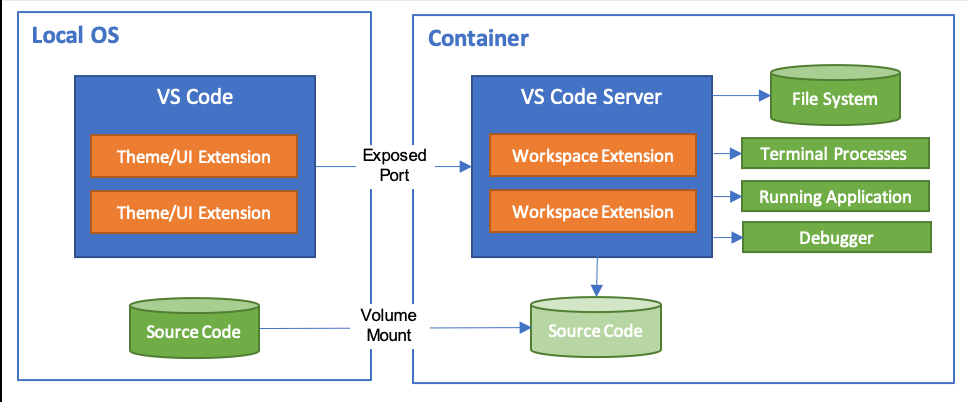

# 2020年12月

## Remote Container

Visual Studio Code(以下、VSCode)の拡張機能

リモート上のコンテナにてVSCodeを使用して開発する事が出来る



WSL2を使用し、ローカル上に環境を構築する事も出来るが以下のデメリットが発生する

- Virtual Boxとの共存が出来ない(VMwareは可能なはず)

- WSL2環境の構築に一手間必要(以前はWin10 2004が必要だったが1909でもアップデートすれば出来るようになった)

コンテナは基本Linux由来の為、Windows自体を動作させる事は出来ない。(厳密にはWindowsコンテナが存在するが、Windows Server向けのマイクロソフト版コンテナが必要。ややこしい)

### Remote Containerの環境

ローカルWindowsには以下のアプリをインストールする必要がある

|アプリ|説明|
|:-|:-|
|VSCode|Remote Container、Remote SSHの拡張機能をインストールしておく|
|Docker for Desktop|Docker CLI(コマンド)を使用する関係上必要(WSL2は不要)。ただ、コンテナ環境出ない為、Windowsを起動する度に警告メッセージが表示されるようになるのがうざい|
|OpenSSH|Windows標準でインストールされているはず(Win10の古いバージョンでなければ)|

今回、リモート先はGCE上に「Container-Optimized OS」とする

### SSHの設定

1. リモートコンテナへはssh経由で接続する為、公開鍵/秘密鍵を以下のコマンドで作成する

```
ssh-keygen -t rsa -f container-key
```

2. 作成したファイルの内、公開鍵はリモートコンテナへ登録する

3. 秘密鍵をローカルのWindowsの「C:\Users\[ユーザー名]\.ssh」フォルダへ移動させる

4. ローカルのWindowsの「C:\Users\[ユーザー名]\.ssh」フォルダへconfigファイルを以下の内容で作成する

```
Host [サーバーのIPアドレス]
  HostName [サーバーのIPアドレス]
  User [リモートのサーバーへのログインユーザー名]
  IdentityFile [3.で移動したファイルパス]
```

5. VSCodeの設定にて「remote.SSH.configFile」に「C:\Users\[ユーザー名]\.ssh」を設定する
   ※必要ないかも

6. VSCodeの設定にて「docker.host」に「ssh://[リモートのサーバーへのログインユーザー名]@[サーバーのIPアドレス]」を設定する

### devcontainer.json

DockerであればDockerfileにコンテナ構成を記述するようにRemote Containerではdevcontainer.jsonに記述します。

詳細は[devcontainer.jsonリファレンス](https://code.visualstudio.com/docs/remote/devcontainerjson-reference)を参照

```
{
  "image": "mcr.microsoft.com/vscode/devcontainers/typescript-node:0-12",
  "forwardPorts": [3000],
  "extensions": ["dbaeumer.vscode-eslint"]
}
```